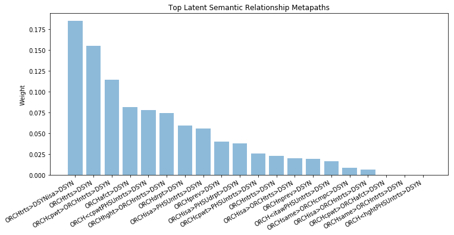

Latent Relationships
====================

Overview
--------

Characterizing the complex and noisy relationships between nodes can be very difficult. However, if we provide many training examples we can characterize a relationship type using a weighted metapath profile. This gives an intuitive representation of the types of paths that are important for a given relationship. For example, we learned the following latent semantic relationship profile that was common to many drug-disease pairs:

Usage
-----

To compute the latent semantic relationship between pairs of nodes, we first need to get 
